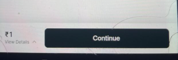

# Vendor:

# Payment Process

## Working Secanrio in Single Flow:

- Customer selects a vehicle, Now two options:

> a) Pay Now(20%):

- Cx click on Pay Now.
- Vendor Accepts booking
- 
- Partial Payment done
- Booking Confirmed in customer App and in vendor App
- 
- Go to Home->Bookings-> Make full payment-> Payment successfull
-  
- 

> b) Pay Full Amount

- cx click on pay full amount
- vendor accepts booking
- 
- Customer click Make Payment-> Payment Gateway opens:
- 
- Payment Successfull-> Booking confirmed.
- 
- 

## Non- Working Secanrio in Single Flow:

> b) Pay Full Amount

- cx click on pay full amount
- vendor accepts booking but in customer side still showing waiting for confirmation
- 
- 
- No customer has no option to go back. So cx minimizes the app and reopens
- bookings->payment->direcly payment gateway opens but price is Rs. 1 (It should be 10)
-  
- Cx pays Rs.1-> Payment Successfull
- 
- Status completed on all platforms: customer, vendor, admin.
- 

# Non Working Scenarios When Customer Minimizes the app:

> a) Pay Now(20%):

- Cx click on Pay Now.
- Vendor Accepts booking
- 
- Cx doesnot do the payment. Cx closes the app and reopens-> bookings-> click on Payment:
-  
- Payment Sucessfull. Now status showing completed in all platforms:
- 
- Now no option of Full Payment.
- 
- In all platforms, the status should be "confirmed" not "completed"

> b) Pay Full Payment:

- Cx click on Pay Now.
- Vendor Accepts booking
- 
- Cx doesnot do the payment. Cx closes the app.
- bookings->payment->direcly payment gateway opens but price is Rs. 1 (It should be 10)
-  
- Payment Sucessfull. Now status showing completed in all platforms:
- 
- 
- In all platforms, the status should be "confirmed" not "completed"

# Admin_Panel:

- All users are showing inactive even if we are using the customer app.
- Number of users in not same in dashboard and useres section. For example, in dashboard it is 10 and in users section it is 53.
# Customer:

- Add terms & privacy and About Vrhaman.
- For incorrect otp, shows Instance of server exception.
- If Loaction is already off and customer opens the app. No pop-up for enable location
- After Log out-> if we click on back option- the login session continues with error. Video shared.
- In my customer account(7381211213), under the bookings, it is showing as Error. It is happening only for me. Tried in 2 devices
- 
